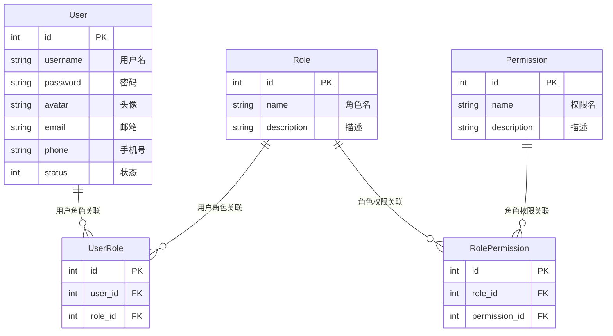
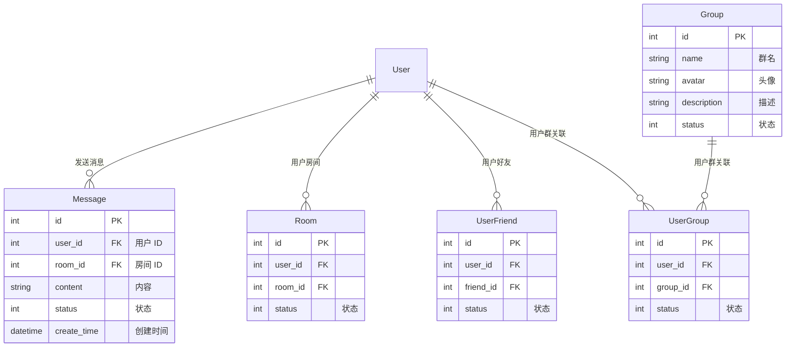

# 2. 模型设计

## 2.1 权限系统

```mermaid
erDiagram
Role ||--o{ UserRole : "用户角色关联"
User ||--o{ UserRole : "用户角色关联"
Permission ||--o{ RolePermission : "角色权限关联"
Role ||--o{ RolePermission : "角色权限关联"

User {
  int id PK
  string username "用户名"
  string password "密码"
  string avatar "头像"
  string email "邮箱"
  string phone "手机号"
  int status "状态"
}

Role {
  int id PK
  string name "角色名"
  string description "描述"
}

UserRole {
  int id PK
  int user_id FK
  int role_id FK
}

Permission {
  int id PK
  string name "权限名"
  string description "描述"
}

RolePermission {
  int id PK
  int role_id FK
  int permission_id FK
}
```

## 2.2 群组系统

```mermaid
erDiagram
User ||--o{ Message : "发送消息"
User ||--o{ Room: "用户房间"
User ||--o{ UserFriend : "用户好友"
User ||--o{ UserGroup : "用户群关联"
Group ||--o{ UserGroup : "用户群关联"

Message {
  int id PK
  int user_id FK "用户 ID"
  int room_id FK "房间 ID"
  string content "内容"
  int status "状态"
  datetime create_time "创建时间"
}

Group {
  int id PK
  string name "群名"
  string avatar "头像"
  string description "描述"
  int status "状态"
}

UserGroup {
  int id PK
  int user_id FK
  int group_id FK
  int status "状态"
}

Room {
  int id PK
  int user_id FK
  int room_id FK
  int status "状态"
}

UserFriend {
  int id PK
  int user_id FK
  int friend_id FK
  int status "状态"
}
```
