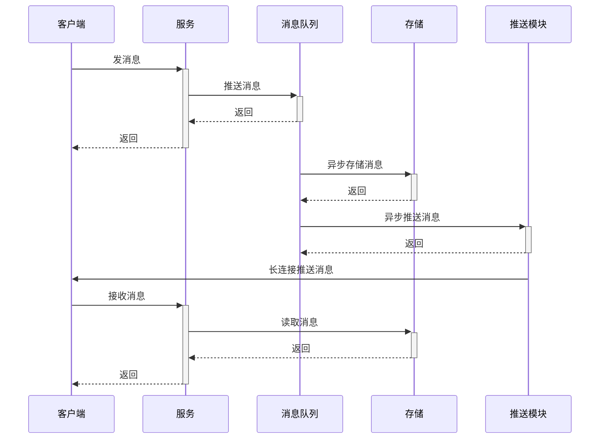
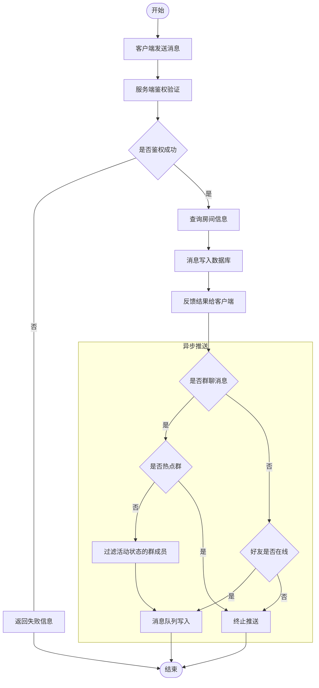
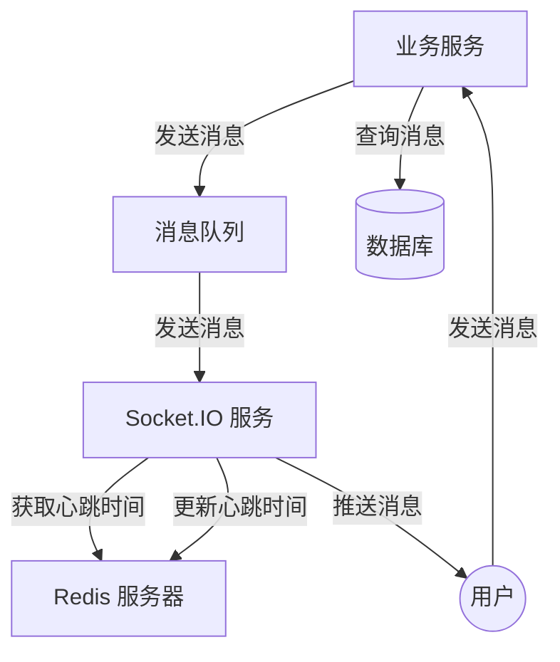

# 3. 工作流程

## 3.1 服务端消息推送

### 序列图

### 架构图

其中：

- Redis 会存储用户的心跳时间，用于判断用户是否在线
- 消息队列的每个消息携带 Room ID、User ID 和加密的消息体
- 由推送服务节点对消息执行逻辑广播
- Socket.IO 中每个房间为每个用户 ID
- 每次用户建立双向连接时，都会进行以下过程：
  1. 通过 HTTP 消息验证用户身份
  2. 服务端订阅此用户 ID 的唯一房间

Redis 维护映射表的方式如下：

每次扫描片段时间，并更新片段内的用户和房间数据。

## 3.2 客户端发送数据

## 3.3 WebSocket 通信流程图

当业务服务器接收到会话消息时，服务器将进行以下过程：

1. 写入消息队列，并返回消息给用户，确认消息已经接收
2. 通过消息队列服务将消息异步写入数据库
3. 消息队列服务将消息推送给 WebSocket 服务
4. WebSocket 服务将消息推送给用户
5. 用户可根据消息的完整性决定是否再次去服务器拉取新消息

