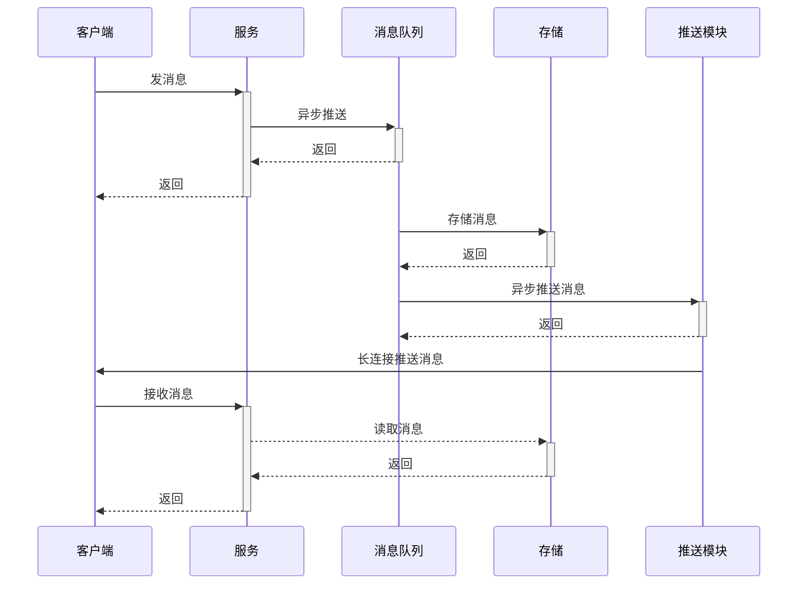
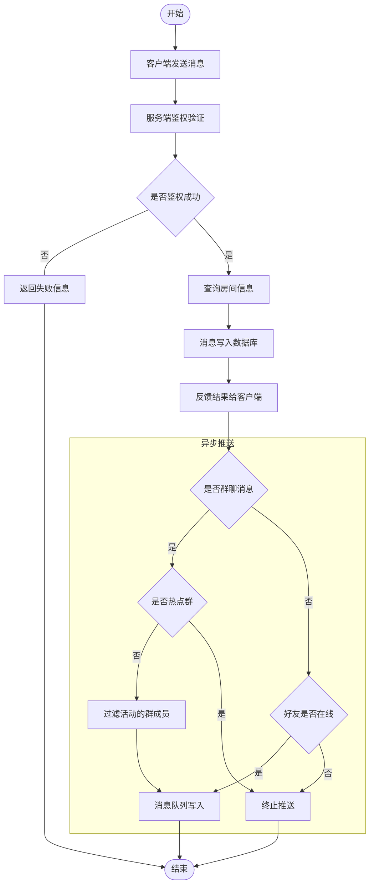

# 3. 工作流程

## 3.1 服务端推送消息序列图

```mermaid
sequenceDiagram
  客户端 ->>+ 服务: 发消息
  服务 ->>+ 消息队列: 异步推送
  消息队列 -->>- 服务: 返回
  服务 -->>- 客户端: 返回

  消息队列 ->>+ 存储: 存储消息
  存储 -->>- 消息队列: 返回

  消息队列 ->>+ 推送模块: 异步推送消息
  推送模块 -->>- 消息队列: 返回

  推送模块 ->> 客户端: 长连接推送消息
  客户端 ->>+ 服务: 接收消息
  服务 -->>+ 存储: 读取消息
  存储 -->>- 服务: 返回
  服务 -->>- 客户端: 返回
```

## 3.2 客户端发送数据流程图

```mermaid
flowchart
  S([开始]) --> Send[客户端发送消息]
  Send --> Verify[服务端鉴权验证]
  Verify --> VerifyOK{是否鉴权成功}
  VerifyOK -- 否 --- Fail[返回失败信息]
    Fail --------> End([结束])
  VerifyOK -- 是 --> QueryRoom[查询房间信息]
    QueryRoom --> SendMsg[消息写入数据库]
    SendMsg --> Feedback[反馈结果给客户端]
    Feedback --> IsGroup{是否群聊消息}
    subgraph AsyncPush[异步推送]
      IsGroup -- 是 --> IsHot{是否热点群}
      IsHot -- 否 --> PreparePush[过滤活动的群成员]
      IsHot -- 是 --> EndPush[终止推送]
      PreparePush --> MQ[消息队列写入]

      IsGroup -- 否 --> IsFriendOnline{好友是否在线}
      IsFriendOnline -- 是 --> MQ
      IsFriendOnline -- 否 --> EndPush
    end
    MQ --> End
    EndPush --> End
```
