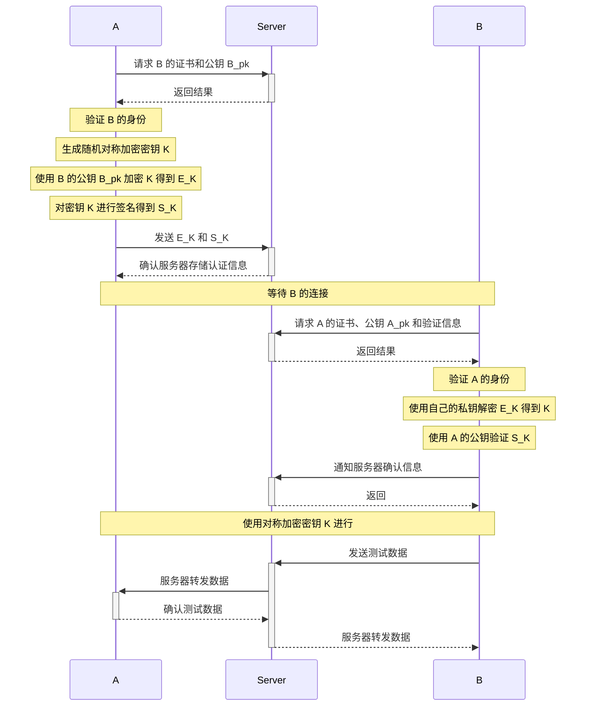
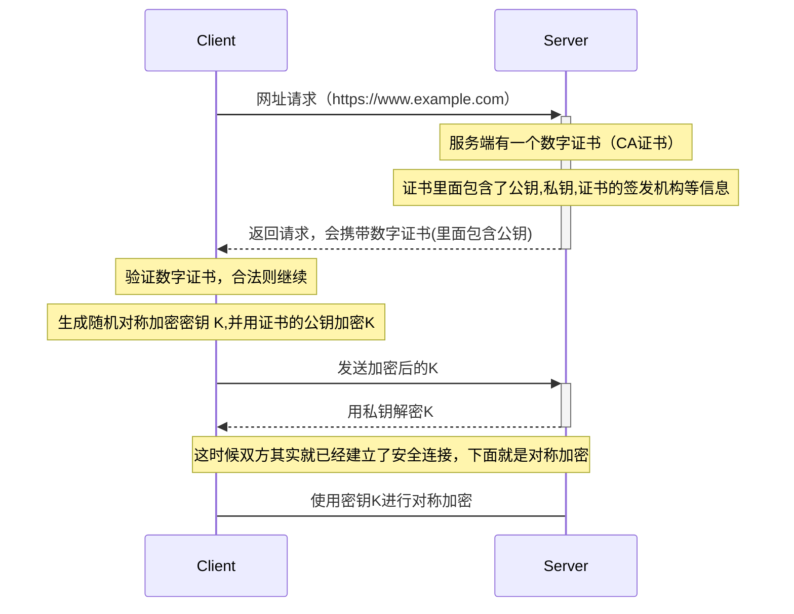

# 4. 端到端加密

## 4.1 简单端到端加密

```mermaid
sequenceDiagram
  A ->>+ Server: 请求 B 的证书和公钥 B_pk
  Server -->>- A: 返回结果
  Note over A: 验证 B 的身份
  Note over A: 生成随机对称加密密钥 K
  Note over A: 使用 B 的公钥 B_pk 加密 K 得到 E_K
  Note over A: 对密钥 K 进行签名得到 S_K
  A ->>+ Server: 发送 E_K 和 S_K
  Server -->>- A: 确认服务器存储认证信息
  Note over A,B: 等待 B 的连接
  B ->>+ Server: 请求 A 的证书、公钥 A_pk 和验证信息
  Server -->>- B: 返回结果
  Note over B: 验证 A 的身份
  Note over B: 使用自己的私钥解密 E_K 得到 K
  Note over B: 使用 A 的公钥验证 S_K
  B ->>+ Server: 通知服务器确认信息
  Server -->>- B: 返回
  Note over A,B: 使用对称加密密钥 K 进行
  B ->>+ Server: 发送测试数据
  Server ->>+ A: 服务器转发数据
  A -->>- Server: 确认测试数据
  Server -->>- B: 服务器转发数据
```

## 4.2 群聊加密验证

- 在群管理员同意时，群管理员需要发布验证消息以共享此群的对称密钥给新成员
- 新成员加群时，需要向管理员证明自身的身份（发送签名和公钥）
- 管理员同意时，将对称密钥加密后发送给新成员
- 设置极限，例如最多向 5 个管理员申请入群

## 4.3 HTTPS 过程

``` mermaid
sequenceDiagram
participant Client
participant Server

  Client ->>+ Server: 网址请求（https://www.example.com）
  Note over Server: 服务端有一个数字证书（CA证书）
  Note over Server: 证书里面包含了公钥,私钥,证书的签发机构等信息
  Server -->>- Client: 返回请求，会携带数字证书(里面包含公钥)
  Note over Client: 验证数字证书，合法则继续
  Note over Client: 生成随机对称加密密钥 K,并用证书的公钥加密K
  Client ->>+ Server: 发送加密后的K
  Server -->>- Client: 用私钥解密K
  Note over Client,Server: 这时候双方其实就已经建立了安全连接，下面就是对称加密
  Client -> Server: 使用密钥K进行对称加密
```
