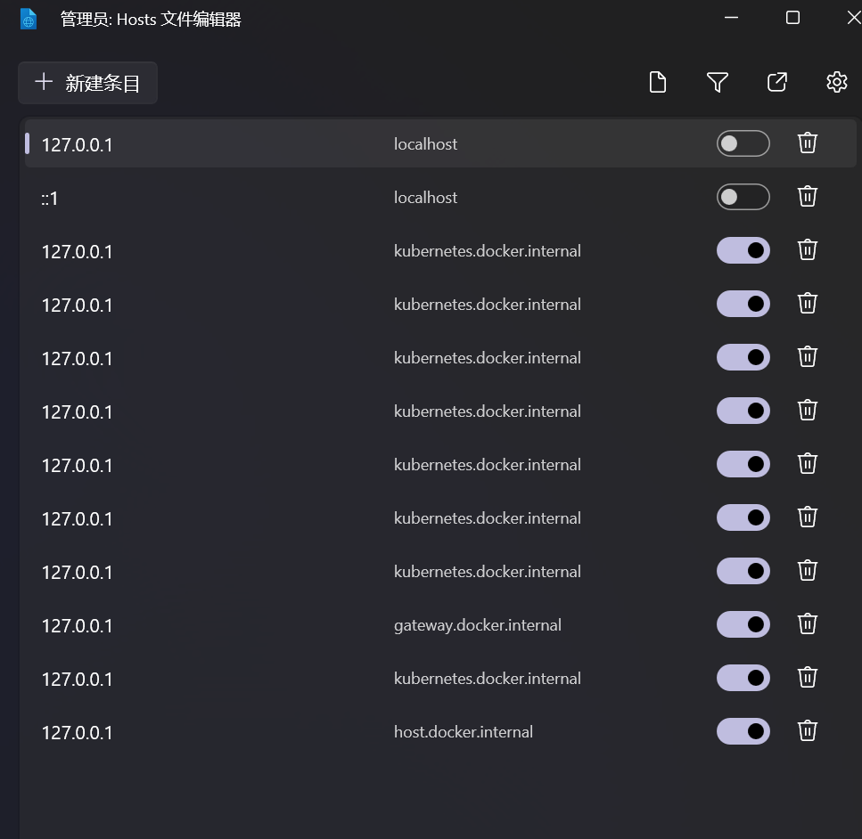

# 开发环境

下面使用 Docker Compose 一键生成开发环境，无需安装 MongoDB、Redis 或 RabbitMQ。

> [!TIP]
> 我们将配置一个 MongoDB 副本集（3 个副本，名称为 `rs0`，用户为 `root`），一个 Redis 实例（无密码）和一个 RabbitMQ 实例（用户为 `admin`）。默认密码都是 `password`，可以通过环境变量设置。

提前拉取镜像：

```bash
docker pull mongo:7.0.5
docker pull rabbitmq:3.13.0-management-alpine
docker pull redis:7.2.4-alpine3.19
```

进入目录：

```bash
cd docs/develop
```

创建 MongoDB 密钥：

```bash
mkdir secrets
openssl rand -base64 756 > secrets/rs0.key
chmod 400 secrets/rs0.key
```

> [!WARNING]
> 如果你使用 Windows，则可能找不到上述命令，你可以选择手动创建 `secrets/rs0.key` 文件，内容为随机字符串。也可以通过 Git Bash 运行上述命令。

启动：

```bash
docker compose up -d
```

等待集群启动完成。

现在需要手动初始化 MongoDB 副本集，进入 MongoDB Shell 环境：

```bash
docker exec -it im-mongo1-dev mongosh
```

初始化集群：

```js
use admin
db.auth('root', 'password')
config = {
  _id: "rs0",
  members: [
    {_id: 0, host: "host.docker.internal:27017"},
    {_id: 1, host: "host.docker.internal:27018"},
    {_id: 2, host: "host.docker.internal:27019"},
  ]
}
rs.initiate(config)
exit
```

返回 `{ "ok" : 1 }` 就说明初始化成功，现在可以通过副本集地址访问 MongoDB 集群了。

退出 MongoDB Shell：

```js
exit
```

删除开发环境：

```bash
docker compose down
```

## 问题排查

对于使用 Docker Desktop 的 Windows 用户，可能会遇到 MongoDB 副本集无法连接的问题，这是可能是因为 Docker Desktop 设置的 `hosts` 文件解析问题。



请确保你的 `hosts` 文件中有 `host.docker.internal` 的解析为 `127.0.0.1`。
